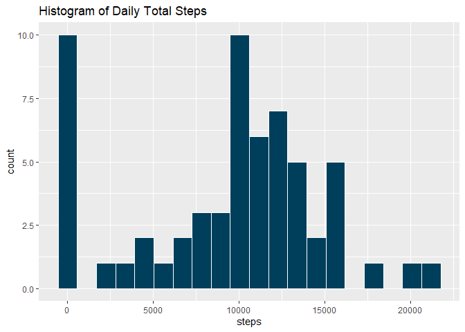
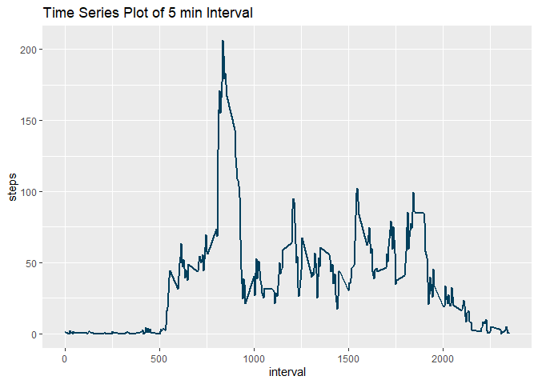
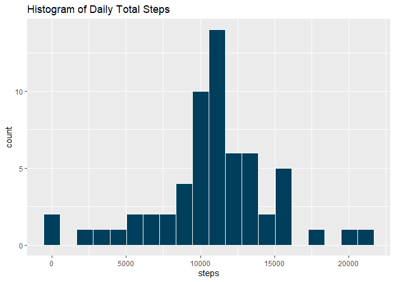
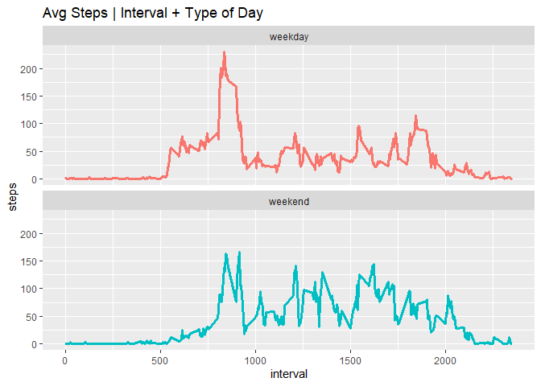

## Introduction 

Introduction

It is now possible to collect a large amount of data about personal movement using activity monitoring devices such as a Fitbit, Nike Fuelband, or Jawbone Up. These type of devices are part of the “quantified self” movement – a group of enthusiasts who take measurements about themselves regularly to improve their health, to find patterns in their behavior, or because they are tech geeks. But these data remain under-utilized both because the raw data are hard to obtain and there is a lack of statistical methods and software for processing and interpreting the data.

This assignment makes use of data from a personal activity monitoring device. This device collects data at 5 minute intervals through out the day. The data consists of two months of data from an anonymous individual collected during the months of October and November, 2012 and include the number of steps taken in 5 minute intervals each day.


## Loading and preprocessing the data


```r
library(readr)
activity <- read_csv("C:/Users/tonyk/Desktop/R/Coursera/Reproducible Research/RepData_PeerAssessment1/activity.zip")
```

```
## 
## -- Column specification --------------------------------------------------------
## cols(
##   steps = col_double(),
##   date = col_date(format = ""),
##   interval = col_double()
## )
```

```r
head(activity)
```

```
## # A tibble: 6 x 3
##   steps date       interval
##   <dbl> <date>        <dbl>
## 1    NA 2012-10-01        0
## 2    NA 2012-10-01        5
## 3    NA 2012-10-01       10
## 4    NA 2012-10-01       15
## 5    NA 2012-10-01       20
## 6    NA 2012-10-01       25
```

```r
str(activity)
```

```
## tibble [17,568 x 3] (S3: spec_tbl_df/tbl_df/tbl/data.frame)
##  $ steps   : num [1:17568] NA NA NA NA NA NA NA NA NA NA ...
##  $ date    : Date[1:17568], format: "2012-10-01" "2012-10-01" ...
##  $ interval: num [1:17568] 0 5 10 15 20 25 30 35 40 45 ...
##  - attr(*, "spec")=
##   .. cols(
##   ..   steps = col_double(),
##   ..   date = col_date(format = ""),
##   ..   interval = col_double()
##   .. )
```


## What is mean total number of steps taken per day?

**Total number of steps by day reported by the results**

```r
total_steps <- with(activity, aggregate(steps, by = list(date), sum, na.rm = T))
colnames(total_steps) <- c("date", "steps")
```

**Histogram of total number of steps** 

```r
library(ggplot2)
g <- ggplot(data = total_steps, aes(x = steps))
g + geom_histogram(bins = 20, color = "white", fill = "#003f5c") + 
    labs(title = "Histogram of Daily Total Steps")
```

<!-- -->

**Mean & median of total number of steps per day**

```r
mean(total_steps$steps)
```

```
## [1] 9354.23
```

```r
median(total_steps$steps)
```

```
## [1] 10395
```


## What is the average daily activity pattern?

**Time series plot of 5 minute intervals**

```r
avg_steps_interval <- with(activity, aggregate(steps, by = list(interval), mean, na.rm = T))

colnames(avg_steps_interval) <- c("interval", "steps")

g2 <- ggplot(data = avg_steps_interval, aes(x = interval, y = steps))
g2 + geom_line(color = "#003f5c", size = 1) +
    labs(title = "Time Series Plot of 5 min Interval")
```

<!-- -->

**Maximum average of steps on a given interval**

```r
max_index<- which(avg_steps_interval$steps == max(avg_steps_interval$steps, na.rm = T))
avg_steps_interval[max_index, 1]
```

```
## [1] 835
```

The maximum average steps on a given interval = 835. 


## Imputing missing values

**Finding total number of NAs**

```r
colSums(is.na(activity))
```

```
##    steps     date interval 
##     2304        0        0
```
There are 2304 NAs in the steps column; none in either of the other columns. 

**Strategy for filling in all of the missing values**
For my strategy, I will be using the mean of the 5 minute interval for each of the NA values. I chose this strategy because I believe that timing of the day because it will account for more variance than any other strategy. 

**Filling in all of the missing values in the dataset**

```r
activity2 <- activity

for(i in 1:dim(activity2)[1]){
    if (is.na(activity2[i,1] == TRUE)){
        activity2[i,1] <- 
            mean(activity2$steps[activity2$interval == activity2[[i,3]]],
            na.rm = TRUE)
    } 
}
```

**Total number of steps by day reported by the results with new dataset**

```r
total_steps2 <- with(activity2, aggregate(steps, by = list(date), sum, na.rm = T))
colnames(total_steps2) <- c("date", "steps")
```

**Histogram of total number of steps with new dataset** 

```r
library(ggplot2)
g <- ggplot(data = total_steps2, aes(x = steps))
g + geom_histogram(bins = 20, color = "white", fill = "#003f5c") + 
    labs(title = "Histogram of Daily Total Steps")
```

<!-- -->

**Mean & median of total number of steps per day with new dataset**

```r
mean(total_steps2$steps)
```

```
## [1] 10766.19
```

```r
median(total_steps2$steps)
```

```
## [1] 10766.19
```

Based on the analysis, the first dataset had a mean of 9354.23 and median of 10395. The second dataset with imputed missing data, the mean and median both came out to 10766.19. 

By imputing missing data with average values based on 5 min intervals, the mean and median increased. This is expected as there are less 0 values. 


## Are there differences in activity patterns between weekdays and weekends?

**Creating new factor variable indicating day type**

```r
library(dplyr)
```

```
## 
## Attaching package: 'dplyr'
```

```
## The following objects are masked from 'package:stats':
## 
##     filter, lag
```

```
## The following objects are masked from 'package:base':
## 
##     intersect, setdiff, setequal, union
```

```r
library(magrittr)

activity3 <- activity2

activity3  %<>%
    mutate(dayType = case_when( 
        weekdays(date) %in% c("Monday", "Tuesday", "Wednesday", "Thursday", 
            "Friday") ~ "weekday",
        weekdays(date) %in% c("Saturday", "Sunday") ~ "weekend"))

activity3$dayType <- factor(activity3$dayType)
```


```r
avgSteps_int_day <- aggregate(steps ~ interval + dayType, 
    data = activity3, FUN = mean, na.rm = T)

g3 <- ggplot(avgSteps_int_day, aes(x = interval, y = steps, color = dayType))
g3 + geom_line(lwd = 1.3) + facet_wrap(~dayType, ncol = 1, nrow = 2) + theme(legend.position = "none") + labs(title = "Avg Steps | Interval + Type of Day")
```

<!-- -->

```r
head(avgSteps_int_day)
```

```
##   interval dayType      steps
## 1        0 weekday 2.25115304
## 2        5 weekday 0.44528302
## 3       10 weekday 0.17316562
## 4       15 weekday 0.19790356
## 5       20 weekday 0.09895178
## 6       25 weekday 1.59035639
```

Overall, it is seems to be difficult to conclude that the type of day affects average number of steps. However, it is clear that on the weekday, the average steps in the early mornings are higher than the weekends. However, people seem to be walking slightly more on a consistent basis during middle of the day on a weekend vs a weekday. 


